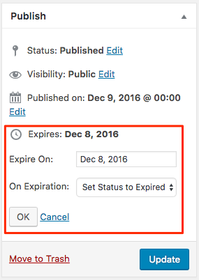
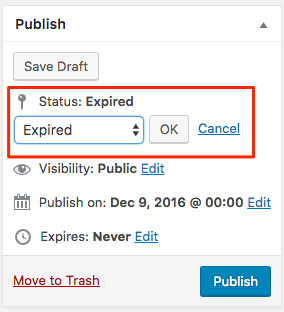
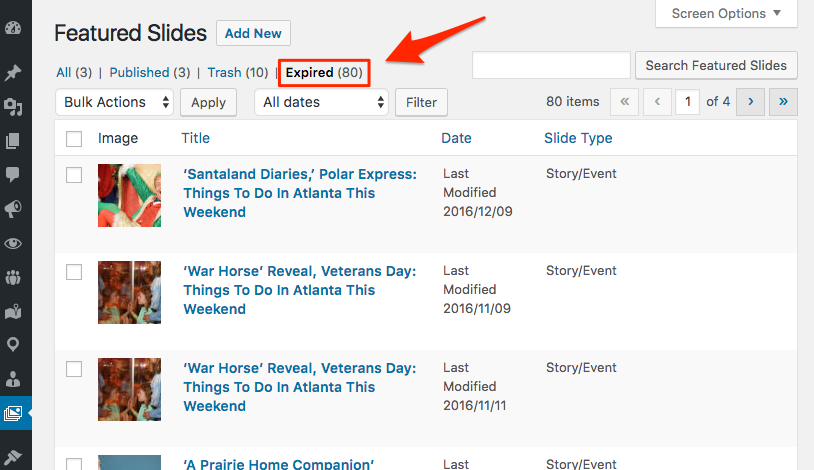

# Post Expiration

A simple post expiration plugin designed for use with no administrator options, or to be used and modified by a PHP developer. 

## End-user Interface
On post types that support expiration an _"Expires:"_ label with an Edit link will appear in the Publish metabox.  Clicking the link will reveal an _"Expires On:"_ date field with a jQuery UI Datepicker and a _"On Expiration:"_ select field that has the options for epirations _(see [_On Expiration_](#on-expiration) section.)_

    
The Publish metabox does not let the user directly set the _"Expired"_ status, but when a post is expired the status will appear in the Publish metabox's status select list. 

In addition, all expired posts will be listed on the post list page in the admin as a selectable status archive.    

## Admin Interface
This plugin has no admin user configuration. Simply activate this plugin and it is ready for use. 

## On Expiration
On expiration posts can be transitioned in one of the following ways:

1. Status set to _"Expired"_
2. Status set to _"Draft"_
3. Post moved to Trash

These transitions are implemented using `wp_update_post()` so all its hooks will be available during transition.     

There are numerous hooks that are available during expiration; see the section below on [Filter Hooks](#filter-hooks).

In addition when expired the current date & time will be stored in the `last_expired` post meta field and the expiration date and method are deleted from post meta. 
        
## Post Types
By default all post types support expiration except for those where:  

- `$post_type=='attachment'`
- `'show_ui' => false`

To change this default you can either set `'can_expire' => false` _(passed an `$arg` to `register_post_type()` for custom post types)_ or filter the array of post types to include only those you want to support expiration using the `'post_expiration_post_types'` hook.      

## Filter Hooks
Hook Name|Type|Parameters|Description
---------|----|----------|-----------
`'post_expiration_post_types'`|filter|<nobr>array `$post_type_names`</nobr>|Allows filtering the array to include only those post types you want to support expiration.
`'pre_post_expiration_posts'`|filter|array `$post_ids` string `$expire_date`| Allows filtering the array of post IDs to omit or add posts to expire. Expire date is the criteria used to find the post IDs in `yyyy-mm-dd` format.
`'do_post_expiration'`|filter|bool `true` int `$post_id` string `$expire_date`|  Allows running code _before_ a specific post ID is expired and/or to short-circuit post expiration on a specific post ID by returning `false` _(to enable post expiration this hook should return `true`)_. Expire date is the same as for `'post_expiration_posts'`. 
`'post_expiration_post_expired'`|action|int `$post_id` string `$expire_date`| Allows running code _after_ a specific post ID is expired. Expire date is the same as for `'post_expiration_posts'`.
`'post_expiration_posts_expired'`|action|int `$post_id` string `$expire_date`| Allows running code _after_ all post IDs have been expired. Expire date is the same as for `'post_expiration_posts'`.
`'post_expiration_display_format'`|filter|string `$date_format_js`|Allows changing the PHP date format from `'M j, Y'` e.g. _"Jan 1, 2017"_ to something else. 
`'post_expiration_display_format_js'`|filter|string `$date_format_js`|Allows changing the Javascript date format from `'M d, yy'` e.g. _"Jan 1, 2017"_ to something else. 
`'post_expiration_datepicker_css'`|filter|string `$css_url`|Allows changing the CSS URL used for styling the jQuery UI Calendar.  If the return value is empty _(e.g. `false`, `null`, `''`, etc.)_ then no URL will be enqueued.
`'post_expiration_css'`|filter|string `$css`|Allows changing the CSS that is used for styling inside the Publish metabox and that is injected into the `<head>` in an `admin_head` action.  The `$css` value passed for filtering includes the `<style>` tags so technically it is HTML and not CSS, but why quibble?
`'post_expiration_data'`|filter|array `$expiration`|Allows filtering the `$expiration` variable containing elements `expires_label`, `expiration_date` and `expire_method` that the controls template is then given access to.  If the return value is empty _(e.g. `false`, `null`, `''`, etc.)_ then no template will be loaded.
`'post_expiration_controls_template'`|filter|string `$css`|Allows changing the template file used to display the "Expires" controls in the publish metabox. This template will have access to an `$expiration` variable which can be filtered by `'post_expiration_data'` If the return value is empty _(e.g. `false`, `null`, `''`, etc.)_ then  no template will be loaded.
`'post_expiration_preferred_method'`|filter|string `$expire_method`|Allows changing preferred expiration method which is normally set to the last experiation method chosen.

## Uses WordPress Cron
Provides expiration by date (no time) using either WordPress pseudo-cron, or manual request to `/wp-cron.php` when `DISABLE_WP_CRON` is set to `true`.

It uses the timezone set in General Settings to determine the date. More specfically it gets "now" using `current_time( 'timestamp' )`.

### TEST MODE
**By default** the expiration process runs continuously; every page load will schedule yet another run of the expiration process.  Obviously this **bad practice** because is adds unnecessary load to your server, however I found that **when the plugin only ran cron once per day people would try the plugin, test it and assume it was not working!** 

Thus, to follow the [**Principle of Least Astonishment**](https://en.wikipedia.org/wiki/Principle_of_least_astonishment) this plugin **defaults to easy testing**. However, for production use **you should always set the following constant** in your `/wp-config.php` site configuration file:

    define( 'POST_EXPIRATION_PRODUCTION_MODE', true );

When `POST_EXPIRATION_PRODUCTION_MODE` is set to `true` cron will schedule to run only once per day which is as it should be.

   
## Composer Support

This plugin has a `composer.json` file to allow it to support [Composer for PHP](https://getcomposer.org/).

## Pull Requests Considered

If you would like to use this and submit a pull request then I welcome the pull request, especially bug fixes. And if your pull request takes this plugin in a consistent direction I will be happy to merge. If it adds complexity my clients do not need I will probably ask you to just continue using your own fork. OTOH, if you want to add an action or filter hook, I will almost certainly do so as I have time to address it. 
